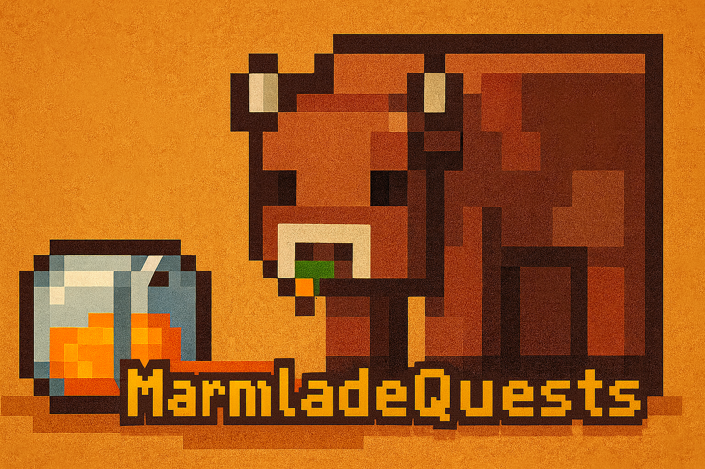

# MarmaladeQuests

One of a kind plugin that powers any survival like server with quests, abilities and so on.

## What does it do?

Marmalade provides great quests and amazing abilities into something like a storyline:

- **Amazing quests!** Users will have over a variety of quests embedded into the plugin, meanwhile developers can create quests for others to enjoy.
- **Abilities!** This plugin includes a variety of abilities, that can be used to fight and so on. Many more abilities can be developed by others too.
- **Good-looking UI's** Meanwhile our plugin won't include a resourcepack for it's gui, the gui's are already good-looking once it's made.

And so much more!

## Development phase?

Currently, the project is under development, and it's under the ALPHA version hence it's in its starting phase.

## Building

To build the project into a plugin, you must have maven installed.

After installing maven, clone the project:
```bash
git clone https://github.com/abdullahcxd/marmaladequests
cd marmaladequests
```

Then build:
```bash
mvn clean package
```

And ta-da! The plugin has been built at `target`.

## License and Development

The project is licensed under the **MIT** license and developed with <3 by **AbdullahCXD**